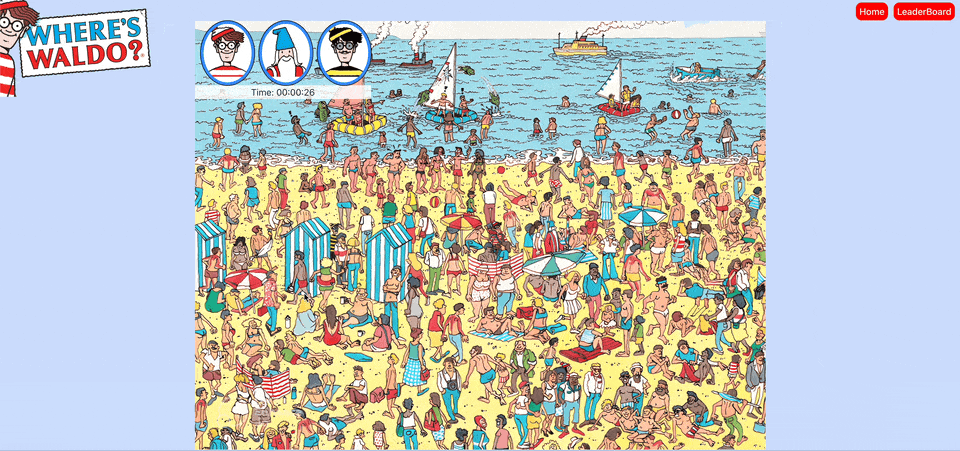

<h1 align="center">Welcome to Wheres-Waldo 👋</h1>
<p>
</p>

> Fun game based on classic Where's Waldo game. User has 3 map choices (easy, medium, hard). See if you can get the new high score on the leaderboard!

### 🏠 Homepage

### Gameplay



### Leaderboard--can you get a new high score?


## Setup instructions

```sh
git clone git@github.com:jwaddell10/Wheres-Waldo.git
npm install
npm run dev
```

## Author

👤 **Jonathan Waddell**

* Github: [@jwaddell10](https://github.com/jwaddell10)

## Show your support

Give a ⭐️ if this project helped you!

***
_This README was generated with ❤️ by [readme-md-generator](https://github.com/kefranabg/readme-md-generator)_
